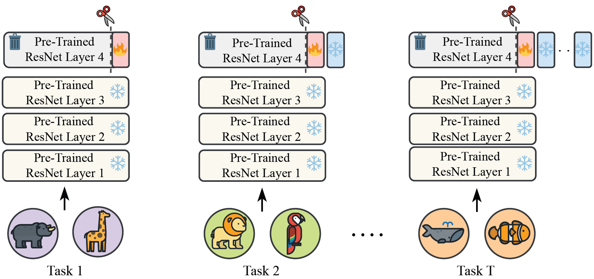

# Slim Adaptation Modules for Pre-Trained Model based Class-Incremental Learning

## 📄 Abstract

Class-incremental learning (CIL) is crucial for developing adaptive systems that can integrate new knowledge without forgetting previously acquired information. While recent research in CIL has primarily focused on adapting pre-trained foundation models to solve catastrophic forgetting, it remains unclear how well these methods actually perform compared to lightweight convolutional networks. Without such comparisons, it is difficult to know whether recent advances truly surpass a strong ConvNet-based baseline.

To address this gap, we propose a baseline that is called ‘Slim Adaptation Modules’ (SAM) a sparse, task-specific last layer of ResNet that enables rapid adaptation while keeping rest of the pre-trained model frozen. By leveraging this structured sparsity and modularity, SAM achieves:

- **~5× reduction in trainable parameters**
- **~6× reduction in total parameters**

Extensive experiments on diverse benchmarks demonstrate that our slim design not only mitigates catastrophic forgetting but also consistently surpasses state-of-the art methods, illustrating its robust and resource-efficient adaptation.



---

## 🚀 How to Run the Code

All experiments can be run using the `main.py` script. Below is a summary of the key configuration option. Please make sure to change them within the `main.py` file to run in the setup you wish.

### 📌 Main Configurations in `main.py`

| Argument         | Description                                                                                   | Example Values                   |
|------------------|-----------------------------------------------------------------------------------------------|----------------------------------|
| `dataset_name`   | Dataset to be used for class-incremental learning                                             | `'cifar100'`, `'imagenetr'`, `'cars'`, `'cub'` |
| `increment`      | Number of new classes introduced per task                                                    | `5`,`10`, `20`, etc.                 |
| `sparsity`       | Percentage of weights to prune in the SAM module (e.g., `0.96` means 96% sparsity)            | `0.95`, `0.96`, `0.97`           |
| `model`          | Backbone model variant (pre-trained ResNet architecture)                                     | `'resnet18'`, `'resnet50'`, `'resnet101'`, `'resnet152'` |

### 📂 Dataset Requirements

- For **ImageNet-R**, **Stanford Cars**, and **CUB-200**, please upload the datasets into the `data/` directory.


## 🧪 Environment Setup

All experiments were conducted using the environment defined in [`sam.yml`](./sam.yml).

To ensure reproducibility, please create and activate the conda environment using the provided `sam.yml` file:

```bash
conda env create -f sam.yml
conda activate sam
